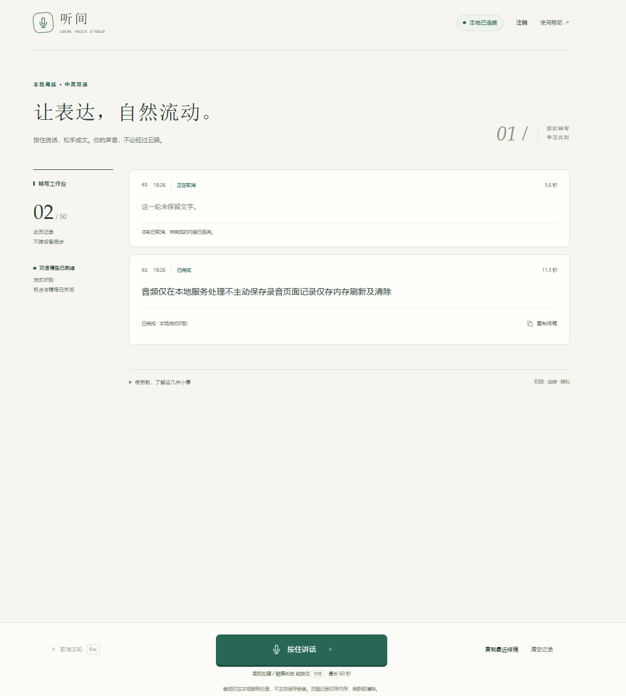

# 听间（LASR）— 本地离线实时语音识别系统

`创建时间：2026年9月22日18:36:59`

听间是一个运行在普通 Windows 电脑上的**本地离线实时语音转写**系统。后端加载 INT8 量化的 Zipformer 双语模型完成中英混说流式识别，前端通过 Web Audio API 采集麦克风音频并经 WebSocket 流式传输。所有推理在本地 CPU 完成，不联网、不上报任何数据。手机通过局域网 HTTPS 访问同一服务。

> **关于名称**：
>
> **ASR**（Automatic Speech Recognition，自动语音识别）是将语音音频转换为文字的通用技术术语。
>
> **LASR**（LASR Local Voice Studio，听间 · 本地语音工作台）是本项目的协议名称与应用代号，"Local" 强调完全本地离线运行的核心特征。代码中的 `lasr` 包名、CLI 入口 `python -m lasr`、WebSocket 子协议 `lasr` 均指向本项目。



---

## 目录

- [1 项目概述与核心特性](#1-项目概述与核心特性)
- [2 需求分析摘要](#2-需求分析摘要)
- [3 技术选型](#3-技术选型)
- [4 系统架构](#4-系统架构)
- [5 项目目录结构总览](#5-项目目录结构总览)
- [6 前端技术栈与代码结构](#6-前端技术栈与代码结构)
- [7 后端技术栈与代码结构](#7-后端技术栈与代码结构)
- [8 音频链路与通信协议](#8-音频链路与通信协议)
- [9 安全机制](#9-安全机制)
- [10 测试方案](#10-测试方案)
- [11 部署与运行](#11-部署与运行)
- [12 性能基线与设计参数](#12-性能基线与设计参数)
- [13 已知限制与待验证项](#13-已知限制与待验证项)
- [14 开发调试记录](#14-开发调试记录)
- [15 许可证](#15-许可证)
- [参考文档索引](#参考文档索引)

---

## 1 项目概述与核心特性

### 1.1 解决什么问题

商业语音识别服务（如云端 ASR API）需要将音频发送到远程服务器，存在隐私泄露风险和网络依赖。听间将全部推理能力封装在一台普通无独显电脑上：模型文件约 190 MB，加载后常驻内存，识别过程不产生任何外部网络请求。

### 1.2 核心特性

| 特性 | 说明 |
|------|------|
| **完全离线** | 运行期前端、模型、依赖全本地；不调用云端 ASR、在线认证或遥测回退 |
| **实时流式** | 原生流式 Zipformer 模型，按住说话时逐句返回草稿（partial），松手后返回终稿（final） |
| **中英混说** | 双语模型支持普通话为主体、中英混合输入 |
| **按住交互** | PC 鼠标左键 / 空格按住录音；手机触摸按住按钮；松手自动停止并排空尾帧 |
| **隐私优先** | 不持久保存音频和正文；不记录日志；内存缓存有上限及销毁点；页面刷新即清空 |
| **局域网多端** | 手机通过局域网 HTTPS 与同源 WSS 访问，无需互联网 |
| **单路有界** | 全机最多一路活动识别；多余连接明确拒绝，不无限排队 |
| **配对鉴权** | 本机配对口令换会话 cookie；Host / Origin 白名单防跨站 |

### 1.3 产品边界

**当前不做**：多人会议转写、声纹 / 说话人分离、持续唤醒词、长文件批处理、模型训练或微调、公网部署、多租户账户、数据库、翻译、情感分析、自动摘要、字幕编辑。

**不承诺**：零错误率、任意口音可用、世界最高准确率、无人值守企业生产 SLA。识别结果不是支付、医疗或身份认证的自动决策依据。

---

## 2 需求分析摘要

### 2.1 用户确认的核心约束

| 约束 | 内容 |
|------|------|
| 语言 | 普通话为主，支持中英混说 |
| 硬件 | 普通无独显 CPU 电脑优先 |
| 访问方式 | 电脑运行后端，手机通过 LAN 浏览器访问 |
| 交互 | 移动端按住按钮；PC 鼠标或空格按住；一轮一个气泡、实时更新 |
| 安全 | 可信 HTTPS + 同源 WSS；用户接受安装并信任本地 CA |
| 网络 | 运行期无互联网依赖，无云端回退 |
| 精修 | 第二遍声学精修默认关闭 |

### 2.2 需求登记（P0 核心链路）

| ID | 需求 | 可观察行为 |
|----|------|-----------|
| R01 | 普通话与中英混说转写 | 中文 CER、英文 WER、数字分别报告质量 |
| R02 | 普通 CPU 部署 | 不要求 CUDA、独显、Docker 或 WSL |
| R03 | PC 按住录音 | 鼠标左键和空格按住；忽略 repeat，避免 IME 冲突 |
| R04 | 手机按住录音 | 单指所有权、capture、抬手提交、pointercancel 取消 |
| R05 | 一轮一卡片 | partial 整段替换且 revision 递增；唯一 final 后不改写 |
| R09 | 完全离线 | 运行期不调用云端 ASR、在线认证或遥测 |
| R10 | 不持久保存 | 不保存音频和正文；内存缓存有上限 |
| R11 | 局域网 HTTPS | 有效且受信任的 HTTPS 与同源 WSS |
| R14 | 实时体验 | 首个非空 partial P95 ≤ 1.5 秒；短轮 stop-to-final P95 ≤ 2 秒 |
| R15 | 单路有界 | 全机最多 1 路活动识别；过载有界拒绝 |

完整需求（R01–R20）与验收映射（A01–A20）详见 `需求分析、技术选型与系统架构/01_需求规格与范围边界.md`。

---

## 3 技术选型

### 3.1 选型原则

在普通 CPU、普通话混说、手机 LAN 和低等待约束下寻找可交付方案。评估顺序：许可与可运行性 → 领域质量 → 实时性 → 资源 → 稳定性。不凭参数量、新旧或星数排名。

### 3.2 最终选型

| 层次 | 选型 | 理由 |
|------|------|------|
| **语音识别引擎** | sherpa-onnx 1.13.8 + Streaming Zipformer 双语 | 原生流式、Windows CPU 路线清晰、Apache-2.0 方向 |
| **模型** | zipformer-bilingual-98590b7e（INT8 encoder/joiner + float32 decoder） | 约 190 MB 磁盘；greedy_search 解码；decode_chunk_len=32 |
| **前端框架** | Vue 3 + TypeScript + Vite | Composition API 适合拆分音频/协议/轮次逻辑为 composable |
| **后端框架** | FastAPI + Uvicorn（单 ASGI 进程） | 同源静态资源、API、WSS；推理不占事件循环 |
| **推理隔离** | 独立常驻 worker 子进程 + 有界 IPC | CPU 隔离、状态可清理、不按核数复制模型 |
| **TLS** | Uvicorn 原生 TLS / mkcert（开发） | 最少组件方案；本地 CA 仅受控 LAN |
| **存储** | 纯内存状态，无数据库 | 符合单机单路、无历史同步范围 |

### 3.3 候选方案比较

| 候选 | 实时机制 | CPU/Windows 取舍 | 结论 |
|------|----------|-----------------|------|
| **A: sherpa-onnx Zipformer** | 原生流式 | 原生 Windows wheel，CPU 友好 | **主选** |
| B: FunASR Paraformer 两遍 | 流式草稿 + 离线精修 | Windows EXE 存在但年代有差异 | 有条件挑战 |
| SenseVoice Small | 非原生流式 | 终稿候选；权重许可有未闭环项 | 保留对照 |
| Whisper large-v3 | 窗口型非原生流式 | 重复计算语义无法消除 | 不适合作默认 |
| Qwen3-ASR | 有流式训练但无流式推理 | vLLM 主 Linux，Windows 需 WSL | 不作默认 |
| FireRedASR2S | 未核实原生流式 | 官方 Ubuntu 测试，Windows 未测 | 保留对照 |
| Moonshine streaming tiny zh | 轻量流式 | 混说质量与 Windows 证据不足 | 补充对照 |

详细评估过程、许可分层与公开评测数字见 `需求分析、技术选型与系统架构/03_技术选型与模型评估.md`。

---

## 4 系统架构

### 4.1 部署拓扑

```text
┌─────────────────────────────────────────────────────┐
│  浏览器（PC / 手机）                                  │
│  Vue 状态机 → AudioWorklet → FIR 重采样 → PCM 网络帧  │
│                    ↕ 同源 HTTPS + WSS                 │
│  ┌────────────────────────────────────────────────┐  │
│  │  局域网 TLS（mkcert 或项目私有 CA）              │  │
│  └────────────────────────────────────────────────┘  │
│                    ↕                                  │
│  ┌────────────────────────────────────────────────┐  │
│  │  单网络进程：FastAPI + Uvicorn                   │  │
│  │  Host/Origin 校验 → cookie 鉴权 → 轮次协调器    │  │
│  │  静态文件服务（前端 dist/）                       │  │
│  └──────────────────────┬─────────────────────────┘  │
│                         │ 有界 IPC（不开放 LAN 端口） │
│  ┌──────────────────────┴─────────────────────────┐  │
│  │  独立常驻推理 worker 子进程                      │  │
│  │  sherpa-onnx OnlineRecognizer                   │  │
│  │  模型加载 → 流状态 → chunk 解码 → segment 累计  │  │
│  │  stop flush → 候选终稿 → 返回协调器             │  │
│  └────────────────────────────────────────────────┘  │
│                    ↕                                  │
│  ┌────────────────────────────────────────────────┐  │
│  │  模型文件 models/zipformer-bilingual-98590b7e/  │  │
│  │  encoder.int8.onnx + decoder.onnx              │  │
│  │  joiner.int8.onnx + tokens.txt + manifest.json │  │
│  └────────────────────────────────────────────────┘  │
└─────────────────────────────────────────────────────┘
```

### 4.2 模块职责

| 模块 | 负责 | 不负责 |
|------|------|--------|
| 页面状态机 | 输入所有权、卡片、权限竞态、取消意图、错误恢复 | 不推断模型内部 segment 就是用户 final |
| AudioWorklet | 样本时钟、FIR 重采样、PCM 量化、尾帧排空 | 不发送 JSON、不持有配对凭据 |
| 网络服务（FastAPI） | TLS、静态资源、API、WSS 校验与连接数限制 | 不在事件循环运行声学推理 |
| 轮次协调器 | 全局槽位、终态仲裁、超时、ACK、资源释放 | 不直接造识别正文 |
| 推理 worker | 常驻模型与单轮状态，返回进度及候选结果 | 不保存录音，不持有浏览器 cookie |

### 4.3 关键不变量

1. **单机单路**：全机最多一个网络进程、一个常驻 worker、一路活动识别
2. **终态唯一**：一个 utterance_id 绑定一个 session_id 和一张卡片；只有协调器能提交外部终态
3. **有界拒绝**：任何一层容量不足都显式拒绝或终止，不无限排队、不静默丢采样
4. **网络隔离**：worker 通过有界 IPC 与网络进程通信，不开放额外 LAN 端口
5. **隐私销毁**：音频在消费后释放；正文只在页面内存展示；连接关闭即销毁缓存

详细架构设计、容量参数与数据生命周期见 `需求分析、技术选型与系统架构/04_系统架构与数据流.md`。

---

## 5 项目目录结构总览

```
项目根目录/
├── models/                              # 离线语音识别模型文件
│   └── zipformer-bilingual-98590b7e/    # 锁定 commit 的固定四文件 + manifest
│       ├── encoder-epoch-99-avg-1.int8.onnx   # 编码器（~182 MB）
│       ├── decoder-epoch-99-avg-1.onnx        # 解码器（~14 MB）
│       ├── joiner-epoch-99-avg-1.int8.onnx    # 联结器（~3.2 MB）
│       ├── tokens.txt                         # 词表（~56 KB）
│       └── manifest.json                      # 制品清单（自动生成）
│
├── 前端/                                # Vue 3 + TypeScript 前端
│   ├── src/                             # 源码（详见第 6 章）
│   ├── tests/                           # Vitest 单元测试（162 用例）
│   ├── scripts/tool.mjs                 # 工具脚本（缓存隔离）
│   ├── dist/                            # 生产构建产物（后端从此提供静态文件）
│   ├── node_modules/                    # npm 依赖
│   ├── index.html                       # SPA 入口
│   ├── vite.config.ts                   # Vite 配置（代理、HTTPS）
│   ├── vitest.config.ts                 # 测试配置
│   ├── tsconfig.json                    # TypeScript 配置
│   └── package.json                     # 依赖声明
│
├── 后端/                                # FastAPI + sherpa-onnx 后端
│   ├── lasr/                            # 核心 Python 包（详见第 7 章）
│   ├── tests/                           # pytest 测试套件（188 用例）
│   ├── tools/prepare_env.py             # 虚拟环境一键准备脚本
│   ├── .venv/                           # Python 虚拟环境
│   ├── pyproject.toml                   # 包元数据、依赖、工具配置
│   └── requirements.lock                # 带哈希的依赖锁文件
│
├── 需求分析、技术选型与系统架构/          # 八篇专题研究文档
│   ├── 00_阶段一导读与决策登记.md
│   ├── 01_需求规格与范围边界.md
│   ├── 02_交互规范与状态机.md
│   ├── 03_技术选型与模型评估.md
│   ├── 04_系统架构与数据流.md
│   ├── 05_音频与实时通信协议.md
│   ├── 06_局域网HTTPS与离线交付运维.md
│   └── 07_测试验收与性能基线计划.md
│
├── 测试复现与本地部署方案.md             # 部署与测试完整方案
├── 前端代码结构与生效流程.md             # 前端 22 个源文件的详细分析
├── images/                              # 文档配图
├── .gitignore                           # Git 忽略规则
└── README.md                            # 本文档
```


---

## 6 前端技术栈与代码结构

### 6.1 技术选型

| 技术 | 版本 | 职责 | 选择理由 |
|------|------|------|----------|
| Vue 3 | 3.5.43 | 响应式 UI 框架 | Composition API 适合将音频/协议/轮次逻辑拆分为 composable |
| TypeScript | 5.9.3 | 类型安全 | 严格协议校验需要精确类型；开启 `noUncheckedIndexedAccess` |
| Vite | 8.3.0 | 构建与开发服务器 | 原生 ESM；worker 格式配置支持 AudioWorklet 打包 |
| Vitest | 5.0.1 | 单元测试 | 与 Vite 共享配置，jsdom 环境 |
| Web Audio API | 浏览器原生 | 音频采集与 Worklet 线程 | AudioWorklet 提供独立音频线程，避免主线程卡顿 |
| WebSocket | 浏览器原生 | 实时双向通信 | 音频帧流式传输需要低延迟双向通道 |

**不使用的技术**：无 Vuex/Pinia（状态由 composable + reactive 管理）；无 axios（直接使用 fetch）；无 Service Worker；无远程字体或 CDN 资源。

### 6.2 源码目录与模块职责

```
前端/src/
├── main.ts                    # 应用入口：createApp(App).mount('#app')
├── App.vue                    # 根组件：布局骨架、状态绑定、composable 消费
├── style.css                  # 全局样式（CSS 变量、响应式断点）
│
├── protocol/                  # 协议层：消息类型定义、运行时校验、音频编码
│   ├── messages.ts            # 所有消息类型与常量的唯一定义
│   ├── schema.ts              # 运行时校验函数（parseObject、parseServer 等）
│   └── audio.ts               # PCM 量化、二进制帧编码、AudioLedger 帧账本
│
├── audio/                     # 音频采集链路：从麦克风到 16kHz PCM 帧
│   ├── capture.ts             # BrowserCapture：getUserMedia 与 Worklet 生命周期
│   ├── capture.worklet.ts     # AudioWorklet 处理器（音频线程专用）
│   ├── clock.ts               # AudioClock：音频时钟桥梁（遗留文件，已不被引用）
│   ├── fir.ts                 # StreamingFIR：流式 FIR 重采样（任意采样率→16kHz）
│   └── pipeline.ts            # CapturePipeline：提交窗、帧打包、排空
│
├── services/                  # 网络服务层：HTTP API 与 WebSocket 连接
│   ├── api.ts                 # LocalApi：pair/logout/status HTTP 调用
│   └── connection.ts          # LasrConnection：WebSocket 会话、心跳、协议校验
│
├── state/                     # 状态管理：轮次生命周期与输入所有权
│   ├── rounds.ts              # RoundManager：录音轮次的创建、消息处理、终态
│   └── input.ts               # HoldInput：指针/键盘输入所有权与事件绑定
│
├── composables/               # Vue Composable
│   └── useStudio.ts           # 顶层 composable：组装 API、连接、轮次、视图
│
└── components/                # Vue 组件
    ├── PairCard.vue           # 配对表单
    ├── TranscriptList.vue     # 转写卡片列表
    ├── HoldControls.vue       # 底部操作栏（按住按钮、取消、复制、清空）
    └── StudioIcon.vue         # SVG 图标组件
```

### 6.3 模块依赖关系

模块依赖严格单向，从底层协议到顶层组件形成清晰层次：

```
components/ ──→ composables/useStudio ──→ services/api
      │                  │                services/connection
      │                  │                     │
      │                  ├──→ state/rounds ──→ protocol/messages
      │                  │        │            protocol/schema
      │                  │        ├──→ protocol/audio
      │                  │        └──→ audio/capture
      │                  │                  ├── audio/pipeline ──→ audio/fir
      │                  │                  └── audio/capture.worklet
      │                  └──→ state/input
      └──→ components/*（子组件引用）
```

### 6.4 端到端数据流

一次完整的录音轮次中，前端数据流如下：

1. **用户按住按钮** → `HoldInput` 获取指针/键盘所有权，发送 `held` 事件
2. **`useStudio` 调用 `RoundManager.prepare()`** → 通过 `LocalApi` 确认模型就绪
3. **`BrowserCapture.start()`** → `getUserMedia()` 获取麦克风流 → 创建 `AudioWorkletNode`
4. **Worklet 线程**：接收原始音频样本 → `StreamingFIR` 重采样至 16kHz → PCM 量化为 Int16
5. **`CapturePipeline`**：累积 100ms 提交窗 → 打包为 320 样本（20ms）的 PCM 帧
6. **`LasrConnection`**：将帧编码为二进制消息 → 通过 WebSocket 发送到后端
7. **接收 partial/final** → `RoundManager` 处理消息 → 更新卡片视图 → 实时草稿整段替换

松手时：`CapturePipeline.stop()` 排空尾帧 → 发送 stop 消息（含最后序号和总样本数） → 等待 final。

### 6.5 关键设计决策

| 决策 | 理由 |
|------|------|
| AudioWorklet 而非 ScriptProcessorNode | 独立音频线程，主线程阻塞不影响采集 |
| 流式 FIR 重采样 | 避免整块重采样的延迟；右上下文延迟可控 |
| Worklet 内帧计数决定松手截止点 | 音频时钟跨域映射在异构硬件上不可靠，已彻底移除 |
| fetch 默认值用箭头函数包装 | 避免 `typeof fetch = fetch` 导致 this 丢失 |
| 状态由 composable + reactive 管理 | 项目规模不需要 Vuex/Pinia 的额外复杂度 |

详细的前端代码分析、22 个源文件的完整功能分布与生效流程见 `前端代码结构与生效流程.md`。

---

## 7 后端技术栈与代码结构

### 7.1 技术选型

| 技术 | 版本 | 职责 | 选择理由 |
|------|------|------|----------|
| Python | 3.11.x | 运行环境 | sherpa-onnx 官方 wheel 支持 |
| FastAPI | 0.141.1 | ASGI 框架 | 原生 WebSocket 支持、生命周期事件、静态文件服务 |
| Uvicorn | 0.53.0 | ASGI 服务器 | 原生 TLS、单进程模型、WebSocket 配置精细 |
| sherpa-onnx | 1.13.8 | 语音识别推理 | 原生流式 Transducer、Windows CPU 友好 |
| websockets | 17.1 | WebSocket 协议 | Uvicorn 的 ws 后端实现 |
| numpy | 2.3.5 | 数值计算 | sherpa-onnx 依赖 |

**开发依赖**：pytest 9.1.1（测试）、pytest-asyncio（异步）、pytest-cov（覆盖率）、ruff（Lint）、httpx（ASGI 测试客户端）、onnx（模型元数据解析）、cryptography（证书生成）。

### 7.2 源码目录与模块职责

```
后端/lasr/
├── __init__.py              # 包标识与版本号
├── __main__.py              # python -m lasr 安全入口（Windows spawn 兼容）
├── cli.py                   # CLI 子命令定义（serve / prepare-models / certificates）
├── app.py                   # FastAPI 组合根（lifespan 管理）
├── config.py                # Settings 数据类与校验（Host/Origin 白名单、cookie 策略）
├── routes.py                # HTTP / WebSocket 路由（配对、状态、静态文件）
├── security.py              # Host / Origin 白名单中间件
├── auth.py                  # 配对口令与会话管理（随机口令、cookie 下发）
├── coordinator.py           # 连接协调与识别调度（全局槽位、终态仲裁）
├── worker.py                # 识别器子进程封装
├── supervisor.py            # 子进程生命周期监控（ProcessWorker、WorkerPort）
├── recognizer.py            # sherpa-onnx 流式识别器适配器
├── protocol.py              # 前后端消息协议（JSON 消息、子协议、帧格式）
├── artifacts.py             # 模型制品约束与校验（固定来源、SHA256 双重验证）
├── prepare_models.py        # 模型下载与完整性验证（HuggingFace 锁定 commit）
├── tls.py                   # 项目私有 CA / 服务器证书生成
├── console.py               # 终端配对口令显示
├── state.py                 # 会话状态
└── audio.py                 # 音频帧解析
```

### 7.3 核心流程

**启动流程**：

1. `__main__.py` 调用 `freeze_support()`（Windows spawn 安全）→ `cli.main()`
2. `cli.py` 解析 `serve` 子命令 → 构造 `Settings` → 调用 `settings.validate()`
3. `app.py` 的 `create_app()` → 构造 `ProcessWorker` → 注册路由与中间件
4. Uvicorn 启动 → `lifespan` 中 `coordinator.open()` → worker 子进程加载模型
5. 模型就绪后终端打印 `LASR_PAIRING_CODE=xxxxxxxx`

**请求处理流程**：

1. `SecurityMiddleware` 校验 Host / Origin 白名单
2. `routes.py` 处理 `/api/pair`（口令换 cookie）、`/api/status`（状态查询）
3. WebSocket `/ws` 握手时校验 cookie + Origin + Host + 连接配额
4. `Coordinator` 管理全局槽位，分配 `session_id`，协调 worker 与连接
5. worker 子进程通过有界 IPC 接收音频帧、返回 partial / final 候选
6. `Coordinator` 原子决定外部终态，分配严格递增 revision

### 7.4 CLI 子命令

| 子命令 | 用途 | 关键参数 |
|--------|------|----------|
| `serve` | 启动识别服务 | `--host`、`--port`、`--dev-localhost`、`--tls-cert`、`--tls-key`、`--allowed-host`、`--allowed-origin` |
| `prepare-models` | 下载 / 校验模型 | `--model-dir`、`--audio`、`--verify-only` |
| `certificates` | 生成私有 CA 与服务器证书 | `--san`（可重复）、`--days`、`--output` |

---

## 8 音频链路与通信协议

### 8.1 音频采集与重采样

```
麦克风（浏览器实际采样率，如 48kHz）
    │
    ▼
AudioWorklet 线程
    │  StreamingFIR（radius=64）流式重采样
    │  任意采样率 → 16kHz
    │  PCM 量化为 Int16
    ▼
CapturePipeline
    │  100ms 提交窗
    │  打包为 320 样本（20ms）的 PCM 帧
    │  最后一帧可短
    ▼
LasrConnection
    │  二进制帧编码：
    │  [seq:4][total_samples:4][pcm_data:N*2]
    ▼
WebSocket 发送
```

**关键参数**：

| 参数 | 值 | 说明 |
|------|-----|------|
| 目标采样率 | 16kHz | 模型要求 |
| 网络帧大小 | 320 样本（20ms） | 640 字节 PCM16 |
| 提交窗 | 100ms | 5 帧一批发送 |
| 单轮上限 | 60 秒 | 960000 个 16kHz 样本 |
| 位深 | 16-bit signed LE | PCM16LE 单声道 |

### 8.2 消息协议（LASR 1.0）

前后端通过 WebSocket 交换 JSON 控制消息和二进制音频帧，使用 `lasr` 子协议。

**客户端 → 服务端**：

| 消息 | 方向 | 说明 |
|------|------|------|
| `hello` | C→S | 连接建立后发送，携带协议版本 |
| `start` | C→S | 申请一轮识别资源 |
| 二进制帧 | C→S | `[seq][total_samples][pcm_data]` |
| `stop` | C→S | 松手停止，声明最后序号和总样本数 |
| `cancel` | C→S | 取消当前轮次 |

**服务端 → 客户端**：

| 消息 | 方向 | 说明 |
|------|------|------|
| `ready` | S→C | 资源就绪，可以开始发送音频 |
| `ack` | S→C | 确认接收，携带 `processed_samples` |
| `partial` | S→C | 实时草稿，整段替换，`revision` 递增 |
| `final` | S→C | 唯一终稿，此后同轮候选全部作废 |
| `error` | S→C | 错误通知，含错误码和重试建议 |

### 8.3 水位与背压

| 参数 | 值 | 说明 |
|------|-----|------|
| 全链路未处理音频硬上限 | 32000 样本（2 秒） | 超过则 OVERLOADED |
| 音频 IPC 队列 | 最多 100 帧 | 受全链路样本预算约束 |
| 警戒水位 | 0.5 秒 | 减少非必要草稿频率 |
| final 硬超时 | 15 秒 | 松手后最长等待 |
| 启动等待 | 5 秒 | start 到 ready |
| 终态重传缓存 | 每连接 16 轮、30 秒 | 连接关闭即销毁 |

客户端用 `produced_samples - processed_samples` 估计端到端积压，用 `bufferedAmount` 补充监视发送缓存。

详细协议定义见 `需求分析、技术选型与系统架构/05_音频与实时通信协议.md`。

---

## 9 安全机制

### 9.1 传输安全

| 层面 | 机制 | 说明 |
|------|------|------|
| **TLS** | HTTPS + WSS | 浏览器音频 API 要求 Secure Context |
| **证书** | mkcert（开发）/ 项目私有 CA（生产） | 开发模式自动信任；生产模式需手动安装 CA |
| **Host 校验** | 白名单精确匹配 | 防 DNS 重绑定 |
| **Origin 校验** | 白名单 + scheme 匹配 | 防跨站请求伪造 |

### 9.2 会话鉴权

```
后端启动 → 终端打印 LASR_PAIRING_CODE=xxxxxxxx
    │
    ▼
前端输入口令 → POST /api/pair { "pairing_code": "xxxxxxxx" }
    │
    ▼
后端验证口令 → 下发会话 cookie
    │  开发模式：lasr_session（HTTP，无 Secure）
    │  生产模式：__Host-lasr_session（HTTPS，Secure + HttpOnly + SameSite=Strict）
    ▼
后续请求携带 cookie → /api/status、/ws 鉴权通过
    │
    ▼
POST /api/logout → 撤销会话、清理连接、删除 cookie
```

**安全约束**：
- 配对口令不写在 URL、localStorage、前端包或常规日志中
- cookie 只保存在浏览器安全存储；网络层仅保存其摘要和有效期
- 每次 WSS 握手同时检查有效 cookie、精确 Origin 和 Host
- 默认最多 4 个有效配对会话和 4 条 WSS 连接
- 注销、会话到期或本机撤销授权会关闭连接

### 9.3 限速与防护

| 机制 | 参数 | 说明 |
|------|------|------|
| 全局配对限速 | 20 次 / 60 秒 | 防暴力猜测口令 |
| 单 IP 限速 | 5 次 / 300 秒 | 防单源频繁尝试 |
| 连接配额 | 最多 4 条 WSS | 多余连接明确拒绝 |
| JSON 消息上限 | 16KiB UTF-8 | 拒绝过大消息 |
| 终态缓存上限 | 每连接 16 轮、30 秒 | 淘汰后返回 STALE_UTTERANCE |

详细安全设计见 `需求分析、技术选型与系统架构/06_局域网HTTPS与离线交付运维.md`。


---

## 10 测试方案

### 10.1 测试规模

| 范围 | 框架 | 用例数 | 说明 |
|------|------|--------|------|
| 后端 | pytest + pytest-asyncio | 188 | 协议、音频、鉴权、安全、协调器、路由 |
| 前端 | Vitest + jsdom | 162 | 协议、音频、时钟、管线、输入、轮次、连接、组件 |
| **合计** | | **350** | |

### 10.2 后端测试

```powershell
cd 后端

# 运行全部测试（默认排除需要真实模型的 real_asr 标记用例）
.venv\Scripts\python.exe -m pytest tests/ -v

# 带覆盖率报告
.venv\Scripts\python.exe -m pytest tests/ --cov=lasr --cov-report=html
# 覆盖率报告输出到 .cache/backend/coverage-html/index.html
```

**测试文件与覆盖范围**：

| 测试文件 | 覆盖模块 | 关键场景 |
|----------|----------|----------|
| `test_protocol.py` | `protocol.py` | JSON 消息解析、子协议校验、帧编码、错误码映射 |
| `test_audio.py` | `audio.py` | 音频帧解析、二进制格式校验 |
| `test_auth.py` | `auth.py` | 配对口令生成/验证、会话管理、TTL 过期、注销撤销 |
| `test_security.py` | `security.py` | Host/Origin 白名单、loopback 豁免、cookie 兼容 |
| `test_coordinator.py` | `coordinator.py` | 全局槽位、终态仲裁、取消清理、worker 故障恢复、清理卡死重启 |
| `test_routes.py` | `routes.py` | HTTP 路由、WebSocket 握手、配对流程、静态文件服务 |

**测试工厂**：`tests/support.py` 提供 `harness()` 工厂函数，注入 mock worker 和时钟，内部已消费 hello 消息。

### 10.3 前端测试

```powershell
cd 前端

# 运行全部单元测试
npx vitest run

# 带覆盖率
npx vitest run --coverage
# 覆盖率报告输出到 coverage/
```

**测试文件与覆盖范围**：

| 测试文件 | 覆盖模块 | 关键场景 |
|----------|----------|----------|
| `protocol.test.ts` | `messages.ts` / `schema.ts` / `audio.ts` | 消息类型校验、运行时解析、PCM 编码、AudioLedger |
| `audio.test.ts` | `capture.ts` | getUserMedia 生命周期、Worklet 消息、权限拒绝 |
| `clock.test.ts` | `clock.ts` | 时钟观察、稳定性判定、零值处理 |
| `pipeline.test.ts` | `pipeline.ts` / `fir.ts` | 提交窗、帧打包、FIR 重采样、排空 |
| `input.test.ts` | `input.ts` | 指针/键盘输入所有权、repeat 忽略、IME 冲突 |
| `rounds.test.ts` | `rounds.ts` | 轮次创建、partial 替换、final 提交、cancel 泄漏修复、generation 栅栏 |
| `connection.test.ts` | `connection.ts` | WebSocket 连接、心跳、协议校验、消息分发 |
| `components.test.ts` | 全部 Vue 组件 | PairCard、TranscriptList、HoldControls、StudioIcon 渲染与交互 |

**测试基础设施**：
- `tests/setup.ts`：TextEncoder / PointerEvent polyfill
- `tests/fixtures.ts`：测试数据工厂（ready / ack / final 消息构造）
- `vitest.config.ts`：jsdom 环境、v8 覆盖率

### 10.4 类型检查与 Lint

```powershell
# 前端类型检查
cd 前端
npx vue-tsc --noEmit

# 后端 Lint
cd 后端
.venv\Scripts\python.exe -m ruff check lasr/ tests/

# 后端自动修复
.venv\Scripts\python.exe -m ruff check --fix lasr/ tests/
```

---

## 11 部署与运行

### 11.1 环境要求

| 项目 | 版本 | 说明 |
|------|------|------|
| Python | 3.11.x | `requires-python = ">=3.11,<3.12"` |
| Node.js | ≥ 22.12.0 | 仅构建期使用 |
| 操作系统 | Windows（主要目标） | Linux / macOS 亦可 |
| 模型文件 | `models/zipformer-bilingual-98590b7e/` | 约 190 MB，需显式下载 |

### 11.2 依赖安装

#### 后端

```powershell
# 方式一：使用项目脚本（推荐）
# 自动创建 .venv、安装依赖、隔离缓存到 .cache/backend/
cd 后端
python tools\prepare_env.py

# 方式二：手动安装
cd 后端
python -m venv .venv
.venv\Scripts\python.exe -m pip install -e ".[dev]"
```

**验证安装**：

```powershell
cd 后端

# 检查依赖完整性（无输出 + 退出码 0 = 完整）
.venv\Scripts\python.exe -m pip check

# 确认 sherpa-onnx 可加载（应输出 1.13.8）
.venv\Scripts\python.exe -c "import sherpa_onnx; print(sherpa_onnx.__version__)"
```

> `pip check` 只验证依赖关系图，不验证原生扩展可加载。sherpa-onnx 是唯一的 C++ 原生依赖，`import` 可暴露 DLL 加载失败等问题。

#### 前端

```powershell
cd 前端
npm install
```

### 11.3 模型准备

```powershell
cd 后端
.venv\Scripts\python.exe -m lasr prepare-models
```

**执行流程**：联网获取 HuggingFace 制品树（锁定 commit `98590b7e`）→ 逐文件下载到 `.partial` 暂存 → 三重校验（Content-Length / 字节计数 / SHA256）→ 解析 encoder 元数据 → 生成 `manifest.json` → 原子重命名 → 输出 JSON → 返回（不加载 recognizer）。

**幂等**：目录已存在且校验通过时直接返回，不重复下载。

**仅校验已有模型**：

```powershell
cd 后端
.venv\Scripts\python.exe -m lasr prepare-models --verify-only
```

### 11.4 开发模式（HTTP 明文，仅 localhost）

最简单的启动方式，适合本机开发调试。前端通过 Vite 代理转发请求到后端。

**终端 1 — 后端**：

```powershell
cd 后端
.venv\Scripts\python.exe -m lasr serve --host localhost --port 8765 --dev-localhost --no-console
```

| 参数 | 作用 |
|------|------|
| `--dev-localhost` | HTTP 明文、放宽 Origin 校验为 loopback、cookie 不使用 Secure |
| `--no-console` | 不从 stdin 读取；配对口令仍在终端打印一次 |

**终端 2 — 前端**：

```powershell
cd 前端
npx vite
```

Vite 开发服务器自动代理 `/api` → `http://localhost:8765`、`/ws` → `ws://localhost:8765`，设置 `changeOrigin: true`。

**访问地址**：`https://localhost:5173`

> 前端开发服务器使用 mkcert 证书提供 HTTPS（浏览器音频 API 要求 Secure Context）。

### 11.5 局域网 HTTPS 模式（生产 / 手机访问）

局域网设备（如手机）需要通过 HTTPS 访问。

#### 步骤 1：生成开发证书（mkcert）

```powershell
# 安装 mkcert（如未安装）
winget install FiloSottile.mkcert
# 刷新 PATH 后安装根 CA
mkcert -install

# 在 前端/ 目录生成证书（含局域网 IP）
cd 前端
mkcert -cert-file .cert.pem -key-file .cert-key.pem localhost 127.0.0.1 ::1 192.168.1.100
```

> 获取真实局域网 IP 时须过滤虚拟网卡：
> ```powershell
> Get-NetIPAddress -AddressFamily IPv4 |
>   Where-Object { $_.InterfaceAlias -match 'WLAN|以太网' -and $_.PrefixOrigin -eq 'Dhcp' } |
>   Select-Object -ExpandProperty IPAddress
> ```

#### 步骤 2：生成生产证书（可选，后端内置 CA）

```powershell
cd 后端
.venv\Scripts\python.exe -m lasr certificates --san localhost --san 192.168.1.100 --days 90
```

产物输出到 `.cache/backend/tls/`：

```
.cache/backend/tls/
├── ca/
│   ├── ca-key.pem          # CA 私钥
│   └── ca-cert.pem         # CA 证书（分发给客户端信任）
├── server/
│   ├── server-key.pem      # 服务器私钥
│   └── server-chain.pem   # 服务器证书链
└── certificate-metadata.json
```

#### 步骤 3：构建前端

```powershell
cd 前端
npx vite build
# 产物输出到 dist/
```

#### 步骤 4：启动后端（带 TLS）

```powershell
cd 后端
.venv\Scripts\python.exe -m lasr serve ^
    --host 0.0.0.0 --port 8765 ^
    --tls-cert .cache\backend\tls\server\server-chain.pem ^
    --tls-key .cache\backend\tls\server\server-key.pem ^
    --allowed-host localhost:8765 ^
    --allowed-host 192.168.1.100:8765 ^
    --allowed-origin https://localhost:8765 ^
    --allowed-origin https://192.168.1.100:8765 ^
    --no-console
```

**访问地址**：`https://192.168.1.100:8765`（后端同时提供 API 和静态文件）

#### 步骤 5：手机端信任 CA（可选）

- **iOS**：设置 → 已下载描述文件 → 安装 → 证书信任设置 → 启用完全信任
- **Android**：设置 → 安全 → 加密与凭据 → 安装证书 → CA 证书
- **桌面浏览器**：接受一次自签警告后 `window.isSecureContext` 即为 `true`

### 11.6 完整启动流程

```
1. 安装依赖
   后端: python tools\prepare_env.py
   前端: cd 前端 && npm install

2. 下载模型
   cd 后端 && .venv\Scripts\python.exe -m lasr prepare-models

3. 模型校验
   cd 后端 && .venv\Scripts\python.exe -m lasr prepare-models --verify-only

4. 自动化测试
   后端: .venv\Scripts\python.exe -m pytest tests/ -v
   前端: npx vitest run

5. 类型检查与 Lint
   后端: .venv\Scripts\python.exe -m ruff check lasr/ tests/
   前端: npx vue-tsc --noEmit

6. 构建前端（生产模式）
   cd 前端 && npx vite build

7. 启动服务
   开发模式: 后端 --dev-localhost + 前端 npx vite
   生产模式: 后端 --tls-cert/--tls-key + 前端 dist/ 由后端提供
```

---

## 12 性能基线与设计参数

### 12.1 设计参数

以下参数为保护性设计值，不代表正常体验目标：

| 参数 | 值 | 说明 |
|------|-----|------|
| 单轮上限 | 60 秒 | 达到上限自动正常 stop |
| 启动等待 | 5 秒 | start 到 ready 最长 |
| final 硬超时 | 15 秒 | 松手后最长等待 |
| 音频积压硬上限 | 2 秒 | 超过则中断当前轮 |
| 积压警戒水位 | 0.5 秒 | 减少非必要草稿频率 |
| 活动连接上限 | 4 条 WSS | 多余连接明确拒绝 |
| 页面卡片上限 | 50 张 | 超限移除最旧终态卡片 |
| 终态重传缓存 | 每连接 16 轮、30 秒 | 连接关闭即销毁 |

### 12.2 体验目标（待实测）

| 指标 | 目标 | 说明 |
|------|------|------|
| 首字延迟 | 首个非空 partial P95 ≤ 1.5 秒 | 起点为采集侧检测到有效语音 |
| 短轮终稿 | stop-to-final P95 ≤ 2 秒（15 秒内轮次） | 包含尾帧排空 |
| CPU 档位 | 4 核 8GB / 6 核 16GB | 待实测目标档位 |

### 12.3 资源预算

| 项目 | 量级 | 说明 |
|------|------|------|
| 模型磁盘 | ~190 MB | 四个文件合计 |
| 单轮 PCM 缓存 | 最多 1920000 字节 | 60 秒 × 16kHz × 2 字节 |
| RTF 计算 | 真实处理耗时 / 音频时长 | 不用墙钟时间代替 |

---

## 13 已知限制与待验证项

### 13.1 已知限制

| 限制 | 说明 |
|------|------|
| 模型不可热替换 | 推理链路从制品校验到文件命名均硬编码绑定到唯一 Zipformer 双语模型 |
| 不支持多人会议 | 单路活动识别，无说话人分离 |
| 无持久化历史 | 页面刷新即清空，不使用 localStorage 或 IndexedDB |
| 无翻译 / 摘要 | 当前只做语音转文字 |
| ITN 未启用 | 数字、日期等保持口语原文 |
| 标点默认关闭 | 需单独授权与性能验证后才启用 |
| 不承诺后台录音 | 切后台、锁屏或页面失焦默认取消 |

### 13.2 待验证项

| 编号 | 信息缺口 | 验证方法 |
|------|----------|----------|
| U01 | 实际目标 CPU 与手机型号未知 | 确认设备清单后分档实验 |
| U02 | 手机混说、数字和轻口音质量未知 | 冻结验收集，CER/WER 分别计分 |
| U05 | 手机本地 CA 信任与后台行为有厂商差异 | 真实 iOS / Android 验证 |
| U08 | 准确率、内存绝对预算仍属建议 | 用业务样本和目标 8GB 档位协商冻结 |

---

## 14 开发调试记录

### 14.1 音频时钟架构重构

**问题**：按住讲话时真机反复报"无法可靠确认松手采样边界…请使用支持音频时钟映射的浏览器"。

**根因分析**：前端音频时钟链路（`clock.ts` + `capture.ts`）存在多重独立缺陷：
1. **量纲错配**：observe() 用相邻两次观测间隔（~20ms）与阈值比较，stable 永不为真
2. **falsy 误判**：`getOutputTimestamp()` 在 AudioContext 刚 resume 后返回 `{contextTime: 0}` 是合法初始值，但 truthy 检查把 0 当假值跳过 observe()
3. **跨时钟域映射不可靠**：不同硬件上 `performanceTime` 与 `contextTime` 的映射精度差异巨大

**最终方案**：彻底移除 AudioClock 间接层。松手截止点改由 worklet 自身精确帧计数决定：`capture.stop()` 向 worklet 发送 `{type:'stop', frame:-1}`，`pipeline.stop(cutoffFrame)` 约定 `cutoffFrame < 0` 即以 `sourceTotal` 为本轮截止点。`clock.ts` 成为不被任何模块引用的遗留文件。

**核心教训**：当"前置证明"式门控在不同硬件上天然不可靠时，修修补补只会制造更多边界 bug，正确做法是消除门控本身。

### 14.2 开发模式配对失败

**问题**：开发模式下前端经 Vite 代理访问后端时"配对响应异常 / 会话丢失"。

**根因**：三重成因叠加——
1. Vite 代理 `changeOrigin: true` 只重写 Host 不重写 Origin；后端安全中间件以 403 拒绝
2. 会话 cookie 名带 `__Host-` 前缀时浏览器强制要求 Secure 属性；HTTP 明文模式非法
3. 前端 `constructor(private request: typeof fetch = fetch)` 导致 this 丢失，真实浏览器抛 `Illegal invocation`

**修复**：
- 后端 dev 模式把 Origin 校验放宽为 loopback 即可
- cookie 名按模式派生：dev 用 `lasr_session`，生产用 `__Host-lasr_session`
- fetch 默认值改为箭头函数包装 `(...args) => fetch(...args)`

### 14.3 警告闪动与快速点击竞态

**问题 1**：转写卡片上的警告标识频繁闪动。
**根因**：`ws.bufferedAmount` 在 localhost 上锯齿波振荡；同时 `ack` 消息处理器直接赋值 `warning` 绕过了迟滞逻辑。
**修复**：从判定条件中彻底移除 `bufferedAmount`，仅保留稳定的 gap 指标；提取 `updateWarning()` 统一方法。

**问题 2**：快速多次点击导致后续录音永久失效。
**根因**：`rounds.ts` 的 `prepare()` 在 `!a.held` 分支只 dispose 不 finish，导致 active 槽位泄漏。
**修复**：补 `cancel()` 调用；`capture.stop()` 先 `postMessage('stop')` 再 `stopTracks()`；`pipeline.push()` 对前向帧跳跃补零容错。

### 14.4 多处直接赋值绕过迟滞保护

**问题**：UI 状态振荡（警告标识频繁切换）。
**根因**：多处代码直接赋值状态变量，绕过了统一的迟滞保护逻辑。
**修复**：所有状态更新统一通过带迟滞的方法调用，迟滞带（≥8000 触发 / <4000 解除）只在一处定义。

---

## 15 许可证

| 组件 | 许可证 |
|------|--------|
| 前端源码（Vue / TypeScript） | 项目自有代码 |
| 后端源码（Python / FastAPI） | 项目自有代码 |
| sherpa-onnx 推理框架 | Apache-2.0 |
| Zipformer 双语模型权重 | Apache-2.0 方向有官方依据 |
| 模型来源 | `csukuangfj/sherpa-onnx-streaming-zipformer-bilingual-zh-en-2023-02-20`，锁定 commit `98590b7e` |

> 代码许可、权重许可、量化衍生物和训练数据须分别处理。最终下载物仍须保留 LICENSE、来源、revision 与哈希。本阶段不宣称已审完训练数据授权。

---

## 参考文档索引

| 文档 | 内容 |
|------|------|
| `需求分析、技术选型与系统架构/00_阶段一导读与决策登记.md` | 决策登记、术语、来源台账 |
| `需求分析、技术选型与系统架构/01_需求规格与范围边界.md` | R01–R20 需求与 A01–A20 验收映射 |
| `需求分析、技术选型与系统架构/02_交互规范与状态机.md` | 输入、权限竞态、终态 |
| `需求分析、技术选型与系统架构/03_技术选型与模型评估.md` | 主选、挑战者、许可分层 |
| `需求分析、技术选型与系统架构/04_系统架构与数据流.md` | 进程、鉴权、状态、容量、隐私 |
| `需求分析、技术选型与系统架构/05_音频与实时通信协议.md` | 字节、消息、水位、超时 |
| `需求分析、技术选型与系统架构/06_局域网HTTPS与离线交付运维.md` | 可信访问、证书、配对 |
| `需求分析、技术选型与系统架构/07_测试验收与性能基线计划.md` | 评价方法、验收矩阵 |
| `测试复现与本地部署方案.md` | 完整部署、测试与模型准备方案 |
| `前端代码结构与生效流程.md` | 22 个前端源文件的详细分析 |
| `后端/README.md` | 后端配置与启动详细步骤 |
| `前端/README.md` | 前端配置与启动详细步骤 |
